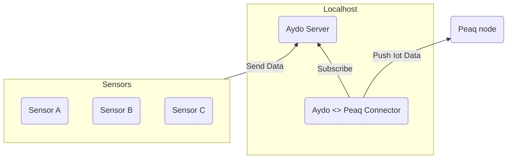
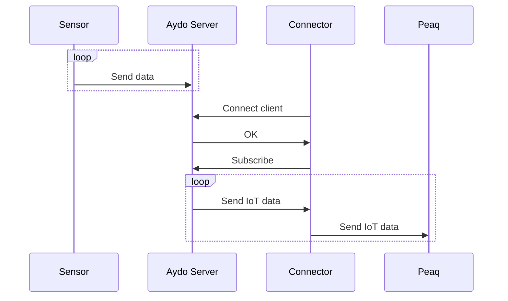

# Aydo <> Peaq Connector

This application is a proof-of-concept Rust implemented to connect an Aydo server and a Peaq blockchain network.

## Installation

Before installing a Substrate-based blockchain node, make sure to install Rust. More details on how to set up a Rust toolchain are covered here:

https://docs.substrate.io/install/rust-toolchain/

### Install and launch a local Peaq node:

```
git clone https://github.com/AYDOAI/substrate_peaq_did_node.git
cd substrate_peaq_did_node

cargo build --release
cargo run --release -- --dev
```

## Install and launch the Connector:

```
git clone https://github.com/AYDOAI/substrate_peaq_did_node.git
cd aydo_peaq_connector

cargo build --release
cargo run --release -- -n dev
```

### Available flags:

#### -n, --network

[REQUIRED] Select the blockchain network to connect to. There are several options:

| Network | Host                                 | Port | Chain ID |
| :------ | ------------------------------------ | ---- | -------- |
| peaq    | https://erpc-mpfn1.peaq.network      | 9933 | 3338     |
| krest   | https://erpc-krest.peaq.network      | 9944 | 2241     |
| agung   | https://rpcpc1-qa.agung.peaq.network | 9944 | 9990     |
| dev     | http://127.0.0.1                     | 9944 | 9990     |

#### -h, --host

[OPTIONAL] This parameter is used to replace the default host

#### -p, --port

[OPTIONAL] This parameter is used to replace the default port

## Functional scheme

The schema below describes the functional scheme of the Aydo <> Peack Connector. The main idea is that a local device (PC, Arduino, Raspberry PI) has a preinstalled [Aydo Server](https://github.com/AYDOAI/aydo-server) and an Aydo <> Peaq Connector.

The Connector expects to find the Aydo Server alive and available at the 1883 port.



The Connector uses the MQTT protocol to subscribe to the data sent by IoT sensors. It is possible to subscribe to a particular topic (or topics), but for testing purposes, we subscribe to the `aydo/#` topic and listen to every sensor out here.

## Algorithm of work

The sequence diagram below describes the algorithm for getting data from the IoT sensor and pushing it to the Peaq network.



The diagram shows that the Connector subscribes to the Aydo Server and listens to the data from the sensors. The Connector processes each transaction consecutively and sends the data to the Peaq network.

It is essential to mention that this business logic is used only for testing purposes. Sending data from the sensors to a public blockchain makes little sense in real-world applications.

To save data to the PeaqDID pallet, we use `Alice` (default Substrate Keyring account) as an owner and a `did_account`. To create the custom name of the DID document, we use the following format:

```
did:aydo:aydo-peaq-client-id-<RANDOM_ID>
```

This identification will be used to represent the particular User or Sensor. It will also be aligned with a DID document so other parties in the network can understand how to interact with it. For testing purposes, we use the empty DID Document, but the production-ready app will structurally follow the [W3C DID Core ](https://www.w3.org/TR/did-core/) architecture principles.

---

THIS SOFTWARE IS EXPERIMENTAL. DO NOT USE IT IN PRODUCTION.
